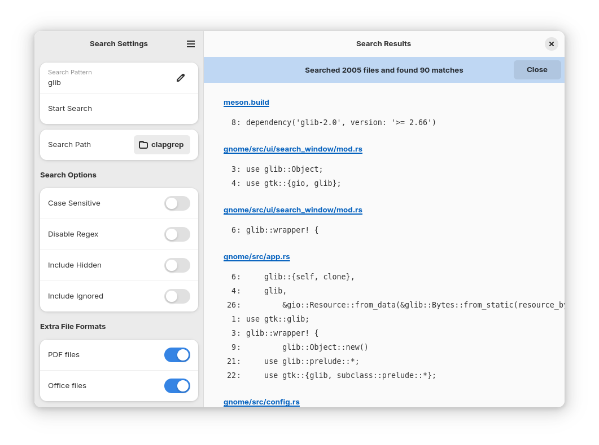

# Clapgrep

One app to search through all your files

## Description

Ever had a folder full of PDF files, where you knew, somewhere in there, is what you're looking for. But you did not know in which file. So you had to search each of them at a time...

With Clapgrep this is no longer necessary! Simply open the folder with Clapgrep, enter the search term, and Clapgrep will do all the hard work of finding out on which page / line in which file the information is that you are looking for!

Clapgrep can currently search all sorts of text files, PDFs and Office documents, with more to come.

## Contributing

See [CONTRIBUTING.md](/CONTRIBUTING.md) for contribution and build instructions.
